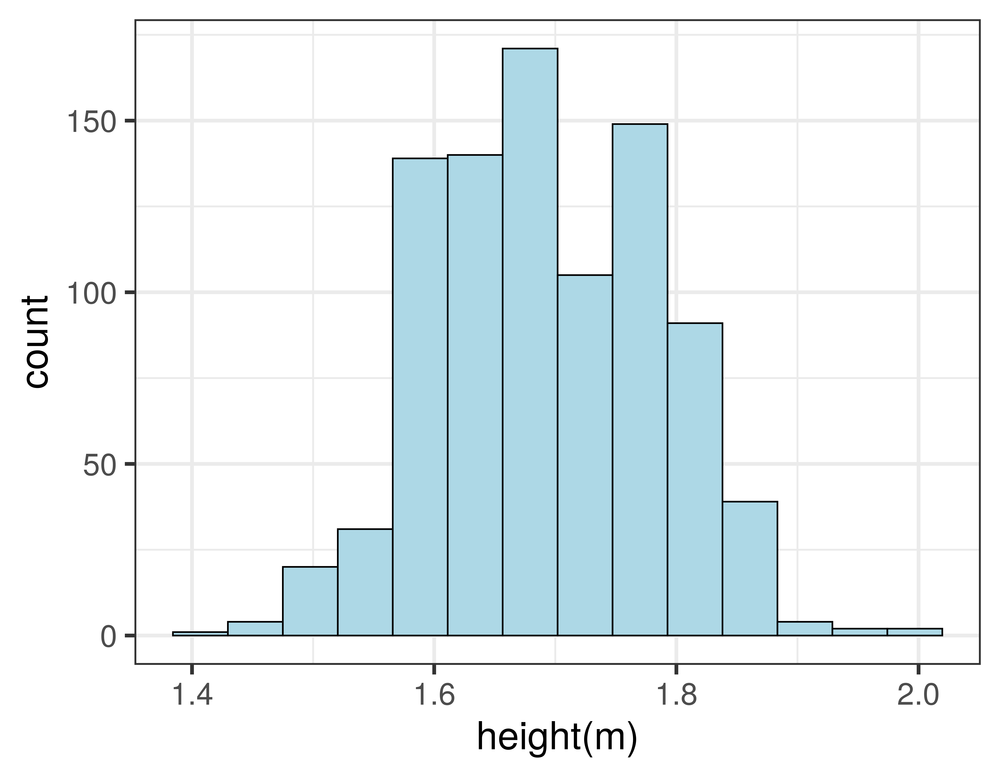
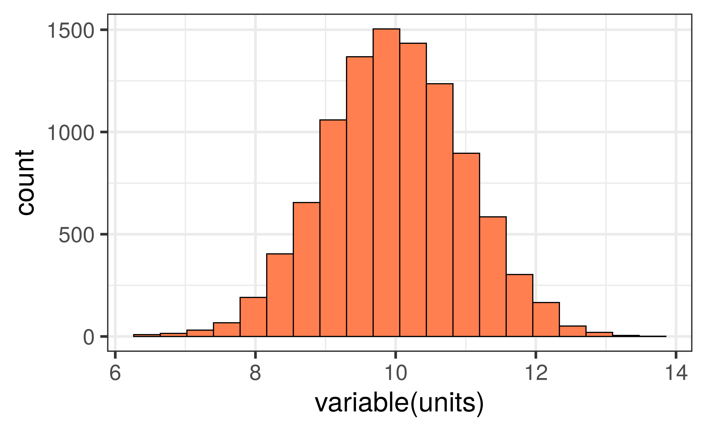
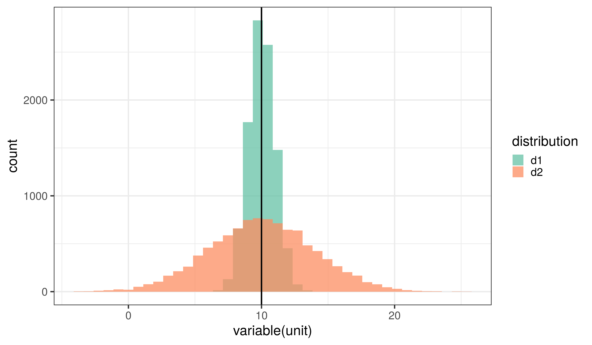

<!-- adding bold and italic options -->
<style>
em {
  font-style: italic
}
strong {
  font-weight: bold;
}
</style>

## In this lecture...

  >- Why stats are important?
  >- Variables
  >- Visualising a categorical variable
  >- Visualising a continuous variable
  >- Measures of central tendency
  >- Measures of dispersion

--- .segue .dark 

## Why stats are important?

--- &vcenter

## Analyse data to answer questions


--- .class #id
  
## Statistics as a tool for communication

<q>France seeing exponential rise...</q>

<q>Flattening the Coronavirus curve...</q>

<q>R number is now between 1.1 and 1.4...</q>

--- .class #id

## Bioinformatics and data science

- Biology + informatics
- Computational analysis of biological data
- A key part of modern biological research
- Links biology, computer science, mathematics and **statistics**
- Part of the emerging field of data science


*Harvard Business Review*

--- &twocol

## Learn coding and programming, e.g. `R`

*** =left

- **Programming language**
- Executed through the **command line**
- Or `Rstudio` environment
- Vast range of analyses
- High quality graphs and diagrams

*** =right


*CC-BY-SA 4.0*


*PAC2, AGPL*

--- .segue .dark 

## Variables

--- .class #id 

## A variable is something that can be measured or counted

### There are three main types:

1. Categorical variables

2. Ordinal variables

3. Quantitative variables
  - Continuous
  - Discrete

### The type of variable determines how data should be analysed and visualised

--- .class #id 

## Categorical variables

*[Can be referred to as qualitative or nominal variables]*

  >- Things that have distinct categories
  >- Qualitative (assigned or named, not quantified)
  >- A fixed (or limited) number of possibilities
  >- Categories cannot be divided or multiplied
  >- Examples: 
    + Presence/absence of anything
    + DNA nucleotides
    + telephone numbers

--- .class #id 

## Ordinal variables

*[Can be referred to as ranked variables]*

  >- Things that can be ranked
  >- Categories that can be put in a sequence
  >- Qualitative (assigned or named, not quantified)
  >- A fixed (or limited) number of possibilities
  >- Categories cannot be divided or multiplied
  >- But we can identify a central (**median**) value
  >- Examples: 
    + Often used in questionnaires, e.g. dislike, indifferent, like
    + Degrees: BSc, MSc, PhD

--- .class #id 

## Quantitative variables

*[Can be referred to as numeric, interval or ratio variables]*

  >- Things that can be measured numerically
  >- Typically have **units**
  >- Values can be divided or multiplied
  >- **Continuous**
    + An infinite number of possibilities
    + Accuracy only limited by the experimental method
    + Temperature, distance, speed, time
  >- **Discrete**
    + Numerical measurements where only certain values are possible
    + Counts, e.g. number of patients, molecules, etc.

--- .segue .dark 

## Visualising a categorical variable

--- .class bg:white

## Visualising a categorical variable

- We can visualise a single categorical or ordinal variable using a **barchart**.
- Categories go on the **x axis** and the counts go on the **y axis**.


--- .class #id

## Barchart example

- Human mitochondrial DNA; 4 nucleotides (A,C,G,T); 16,568 bp


```
##                                                                        V1
## 1  GATCACAGGTCTATCACCCTATTAACCACTCACGGGAGCTCTCCATGCATTTGGTATTTTCGTCTGGGGG
## 2  GTGTGCACGCGATAGCATTGCGAGACGCTGGAGCCGGAGCACCCTATGTCGCAGTATCTGTCTTTGATTC
## 3  CTGCCCCATCCCATTATTTATCGCACCTACGTTCAATATTACAGGCGAACATACTTACTAAAGTGTGTTA
## 4  ATTAATTAATGCTTGTAGGACATAATAATAACAATTGAATGTCTGCACAGCCGCTTTCCACACAGACATC
## 5  ATAACAAAAAATTTCCACCAAACCCCCCCTCCCCCGCTTCTGGCCACAGCACTTAAACACATCTCTGCCA
## 6  AACCCCAAAAACAAAGAACCCTAACACCAGCCTAACCAGATTTCAAATTTTATCTTTTGGCGGTATGCAC
## 7  TTTTAACAGTCACCCCCCAACTAACACATTATTTTCCCCTCCCACTCCCATACTACTAATCTCATCAATA
## 8  CAACCCCCGCCCATCCTACCCAGCACACACACACCGCTGCTAACCCCATACCCCGAACCAACCAAACCCC
## 9  AAAGACACCCCCCACAGTTTATGTAGCTTACCTCCTCAAAGCAATACACTGAAAATGTTTAGACGGGCTC
## 10 ACATCACCCCATAAACAAATAGGTTTGGTCCTAGCCTTTCTATTAGCTCTTAGTAAGATTACACATGCAA
## 11 GCATCCCCGTTCCAGTGAGTTCACCCTCTAAATCACCACGATCAAAAGGGACAAGCATCAAGCACGCAGC
## 12 AATGCAGCTCAAAACGCTTAGCCTAGCCACACCCCCACGGGAAACAGCAGTGATTAACCTTTAGCAATAA
## 13 ACGAAAGTTTAACTAAGCTATACTAACCCCAGGGTTGGTCAATTTCGTGCCAGCCACCGCGGTCACACGA
```

--- .class bg:white

## Barchart example

- Human mitochondrial DNA; 4 nucleotides (A,C,G,T); 16,568 bp


--- .segue .dark 

## Visualising a continuous variable

--- .class bg:white

## Histograms

- We can visualise a single quantitative variable (continuous or discrete) using a histogram
- First we need to bin our data: sort into non-overlapping intervals of equal size
- The bins go on the x axis and the counts go on the y axis.


--- &twocol

## Histogram example

*** =left

- Heights of 898 people, in metres 


```
##    height
## 1    1.86
## 2    1.76
## 3    1.75
## 4    1.75
## 5    1.87
## 6    1.84
## 7    1.66
## 8    1.66
## 9    1.80
## 10   1.73
## 11   1.79
## 12   1.74
## 13   1.70
```

*** =right

- Binned data


```
##    start finish counts
## 1   1.40   1.45      3
## 2   1.45   1.50      3
## 3   1.50   1.55     44
## 4   1.55   1.60    122
## 5   1.60   1.65    163
## 6   1.65   1.70    171
## 7   1.70   1.75    149
## 8   1.75   1.80    146
## 9   1.80   1.85     76
## 10  1.85   1.90     13
## 11  1.90   1.95      6
## 12  1.95   2.00      1
## 13  2.00   2.05      1
```

--- .class bg:white

## Histogram example

- Using 14 bins



--- .class bg:white

## Effect of bin size

- Using 7 bins


--- .class bg:white

## Effect of bin size

- Using 28 bins


--- &twocol bg:white

## Data distribution

- The shape of the histogram can be called a **distribution**
- Height is an example of the **normal distribution**
- It looks (more or less) like a symmetrical bell
- Very tall and very short people are rare, most people are around the middle
- Many other variables: birth weight, blood pressure, measurement error

*** =left


*** =right



--- .segue .dark 

## Measures of central tendency

--- .class bg:white

## Describing distributions for quantitative variables


--- &twocol

## Measure of central tendency

- An average: it describes the central position of the distribution
- It summarises the entire distribution in a single value

*** =left

- We use three types: 
  + `mean`
  + `median`
  + `mode`

*** =right


--- .class #id

## How are they calculated?

### Mean
  + Add all values together and divide by number of observations
  + Good for continuous variables, discrete variables may need rounding

### Median
  + Arrange values from smallest to largest and pick the middle one
  + Good for continuous, discrete, and ordinal variables

### Mode
  + The most frequently occurring value
  + Good for discrete and ordinal variables

--- .class #id

## Discrete variable example

```console
1  2  3  3  4  4  4  5  5  5  5  6  6  6  7  7  8  9 10
```

### Mean

```console
1+2+3+3+4+4+4+5+5+5+5+6+6+6+7+7+8+9+10 = 100
100 / 19 = 5.263158
```
### Median

```console
5
```

### Mode

```console
5
```

--- &twocol bg:white

## Continuous variable example

- Height of 500 women, plotted as a histogram

*** =left


*** =right

<span style="color:#7570B3; font-weight:bold">mean = 1.6528494 m</span>  
<span style="color:#D95F02; font-weight:bold">median = 1.6532279 m</span>

  >- Mean and median are virtually identical
  >- A feature of the normal distribution
  >- So why do we need different measures?
  >- Not all variables are normally distributed

--- &twocol bg:white

## Ancient DNA fragment length

- DNA in ancient samples is highly fragmented
- The fragment lengths have a **skewed distribution**

*** =left


*** =right


800 year old cat (Carl Vivian, Uni Leicester)

<span style="color:#7570B3; font-weight:bold">mean = 45.8054171 bp</span>  
<span style="color:#D95F02; font-weight:bold">median = 41 bp</span>  
<span style="color:#E7298A; font-weight:bold">mode = 31 bp</span>

--- .segue .dark 

## Measures of dispersion

--- .class bg:white

## Same mean, very different distribution



--- &twocol bg:white

## Box plot

*** =left

- Also know as a box and whisker plot
- Displays five summary statistics:
  + **Median** (50th percentile)
  + **lower quartile** (25th percentile)
  + **upper quartile** (75th percentile)
  + **minimum** (0th percentile)
  + **maximum** (100th percentile)
- Plus any **outliers**
- Note upper - lower quartile is the **interquartile range**
  
*** =right


--- .class #id

## Variance and standard deviation

### Variance

- Average of the squared differences from the mean
- For all value, subtract the Mean and square the result, then calculate the average
- Always positive, large numbers indicate more dispersion

### Standard deviation

- Square root of the variance
- In the same units as the data (easy to interpret!)
- For normally distributed data, 68% of observations fall within 1 SD of the mean, 95% with 2 SDs, and 99.7% within 3 SDs

--- .class bg:white

## Standard deviation and the normal distribution


- **Mean = 15.0149312**, <span style="color:#E7298A; font-weight:bold">Standard deviation = 3.0303673</span> 

--- &twocol bg:white

## Barchart using mean and standard deviation

*** =left


  
*** =right


--- .class #id

## In this lecture...

- Why stats are important?
- Variables
- Visualising a categorical variable
- Visualising a continuous variable
- Measures of central tendency
- Measures of dispersion

--- &thankyou

## Next time

**Hypothesis testing, probability and test of frequencies**
